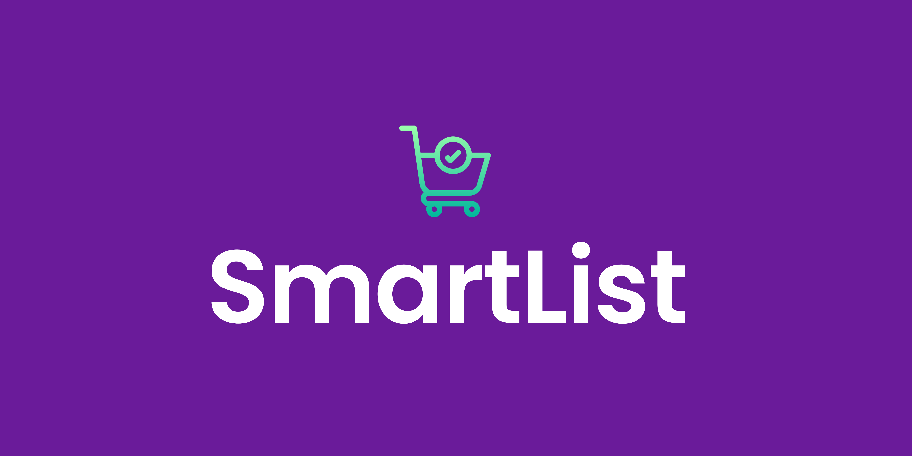

# SmartList - Lista de Compras

> O SmartList permite criar e gerir listas de compras de forma simples e eficiente. Com uma interface intuitiva, pode adicionar, remover e organizar itens de acordo com suas necessidades. Ideal para manter o controlo das suas compras.

## 🌱 Informações do Projeto
- Projeto para disciplina de POO 2024.1.

## ☕ Linguagens

## 🤝 Colaboradores

Agradecemos às seguintes pessoas que contribuíram para este projeto:

<table>
  <tr>
    <td align="center">
      <a href="#" title="defina o título do link">
         
        
          <b>Jeasiel Abner</b>
        
      </a>
    </td>
    <td align="center">
      <a href="#" title="defina o título do link">
         
        
          <b>Clauderson Branco</b>
        
      </a>
    </td>
    <td align="center">
      <a href="#" title="defina o título do link">
         
        
          <b>Aline Fernanda</b>
        
      </a>
    </td>
  </tr>
</table>
